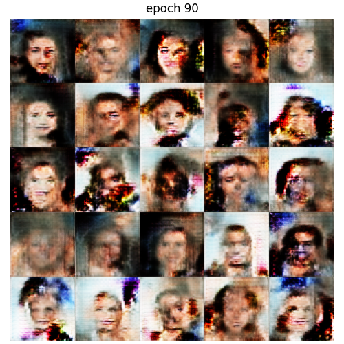
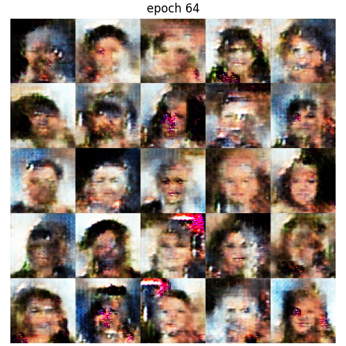

# Tensorflow-MINST-CelebA-VAE-GAN

这是一个练手项目，主要用来实现VAE和GAN的一些基本模型，相对而言比较简单。

采用的数据集为`MINST`和`CelebA`

## MINST

|CVAE|labeled CVAE|GAN|WGAN-GP|
|:---:|:---:|:---:|:---:|
||||

|WGAN-GP|WGAN-GP_Inception|SAGAN||
|:---:|:---:|:---:|:---:|
|||

- 都不是很清晰，可能原因是参数太少了，刚百万，训练的轮次比较少

## 训练GAN的一些trick

参考: [训练GANs一年我学到的10个教训](https://zhuanlan.zhihu.com/p/79959150)
