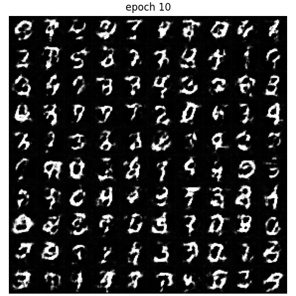

# Tensorflow-MINST-CelebA-VAE-GAN

实现VAE和GAN的一些基本模型。

采用的数据集为`MINST`和`CelebA`

## MINST

|CVAE|labeled CVAE|GAN|WGAN-GP|
|:---:|:---:|:---:|:---:|
||||

|WGAN-GP|SNGAN|||
|:---:|:---:|:---:|:---:|
|||

## 训练GAN的一些trick

参考: [训练GANs一年我学到的10个教训](https://zhuanlan.zhihu.com/p/79959150)

- 调参调了很久，生成的效果很依赖生成器的结构，但后期一不小心可能会出现辨别器不收敛的情况。
- 整体而言还是网络结构越复杂（层数越多，参数越多越清晰。）

## Spectral Normalization

Spectral Normalization 很有效

reference: https://github.com/thisisiron/spectral_normalization-tf2

